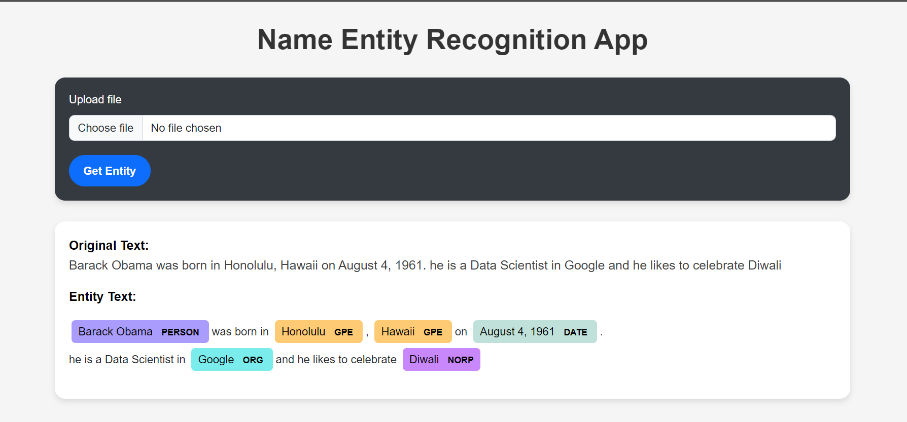

# Named Entity Recognition (NER) App

This project is a simple web application that performs Named Entity Recognition (NER) on uploaded text files. The app extracts entities such as names, locations, and organizations from the input text and displays them in a structured format.

## Features

- Upload a text file.
- Extract and display named entities (like names, locations, organizations, etc.).
- Simple and intuitive user interface using Bootstrap for styling.

## Demo




## Technologies Used

- Python
- Flask (Backend Framework)
- spaCy (Named Entity Recognition)
- HTML, CSS (Bootstrap for Styling)
- JavaScript (for handling UI interactions)

## Setup and Installation

Follow the steps below to set up and run this project locally.

### 1. Clone the Repository

```bash
git clone https://github.com/anindyaPriavte/Name_entity_recognition.git
cd ner-app
```
## 2. Create a Virtual Environment
### Create and activate a virtual environment to keep your dependencies isolated.
# Create virtual environment
```bash
python -m venv venv
```
# Activate the virtual environment
# For Windows
```bash
venv\Scripts\activate
```
# For MacOS/Linux
```bash
source venv/bin/activate
```

## 3. Install Dependencies
### Run the following command to install the required dependencies for the project:
```bash
pip install -r requirements.txt
```
## 4. Download spaCy Model
### This app uses the spaCy library for Named Entity Recognition. Download the required spaCy model using:
```bash
python -m spacy download en_core_web_sm
```
## 5. Run the Application
### After the setup, you can run the app locally using Flask.
```bash
python app.py
```
#### By default, the app will be available at http://127.0.0.1:5000/.

## 6. Open the Application
### Open your web browser and go to http://localhost:5000 to view the NER app in action.

## Usage

1.Upload a text file that contains sentences.

2.Click the "Get Entity" button.

3.The app will display the extracted entities from the text below the file upload section.

## Example
### If you upload a file with the following text:
"Barack Obama was born in Hawaii. He was the 44th President of the United States."

### The app will extract and display entities such as:

Barack Obama → PERSON
Hawaii → GPE (Geopolitical Entity)
United States → GPE

## Project Structure
```bash
├── app.py                  # Flask app and routes
├── templates/
│   └── index.html          # Main HTML template
├── static/
│   ├── css/
│   │   └── style.css       # Custom styles (if any)
├── requirements.txt        # Project dependencies
└── README.md               # This readme file
```

## Contact
If you have any questions or suggestions, feel free to contact me at my_official2023@outlook.com.

## Happy coding! 🎉

